# Firmware Detail

## Introduction 
Totem Pole Demonstrator Application hardware can be ran in both Power Factor Correction and Grid Tied Inverter Mode. Following section briefly explains the theory of PFC, to highlight the main functions and responsibilities of the firmware. Grid Tied inverter is the same, except that the direction of power is reversed.

### Power Factor Correction
AC power has two components: Real and Reactive Power. Real power is the one that is used to do useful work, turn motors, generate heat etc and is expressed in watts. Reactive Power on the other hand does no useful work. Reactive Power is required to maintain electric or magnetic feilds in reactive loads, such as induction motors. Reactive Power is expressed in Volt Amperes VAr. The total demand from the load is combination of these two powers, and is called as Apparent Power, and expressed is VA. Power Factor is a ratio of real power to apparent power. Power Factor is unitless, and ranges from 0 to 1. The goal of Power Factor Correction is to reduce the reactive power, so that the system appears as a resistive load.

## Totempole PFC Firmware Responsibilities 

In a traditional PFC circuit, rectification involves passing current through a diode bridge. Conduction losses assoicated with these diodes at high power, especially at higher power, can cause the system efficiency to be reduced. A bridgeless topology can be used. Totempole is one the popular topology. 

Totempole acheives PFC by boosting the voltages up so that the output voltage of the PFC stage is higher than the input line voltage. It is similar to having a rectifier and a boost circuit for both positive and negative half cycles of the line voltage. 

The critical part of a normal totem pole operation is _zero crossing_, or the point where the AC voltage switches polarity from one half cycle to the other half cycle. As the polarity switches, so does the roles of the switches in the PFC topology.

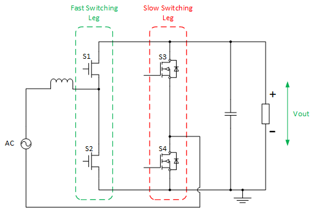  


The high level functions of a PFC system would then be 

1. Zero Cross, positive and negative cycle detection of the input line voltage
2. Configuring the slow switching leg as per the half cycle to operate in boost mode
3. Modulating the duty cycle of the fast switching leg as per load
4. React to any changes in the operating enviornment, ensuring safe operation of the device
5. Commuincation with the outside world and various housekeeping functions

### Division of Functions across Controllers

In this implementation of the PFC, the responsibilities are segregated across multiple controllers, while the bulk of responsibilty resides with the main dsPIC33CH dual core controller.

The main microcontrollers used in this project that are central to the PFC operation are

-	A dsPIC33CK on the Isolated Voltage Acquisition Board  
-	A dsPIC33CH (dual core) on the main power board  

There are also two PIC16 microcontrollers used for housekeeping functions.   

-	A PIC16 on the main power board
-	A PIC16 on each SiC card

See the following for an illustration of the processes running on the different microcontrollers. Note that for both cores of the dsPIC33CH microcontroller, only two priority levels are used. The higher priority interrupt-driven processes are show in green and the lower priority background processes are shown in orange. Any schedulers are driven by polling timer overflow/interrupt flags in the background loop, and are interrupted by the higher priority processes. 

<p>
<p>
<a target="_blank" rel="nofollow" href="images/tppfc-04_s.png">
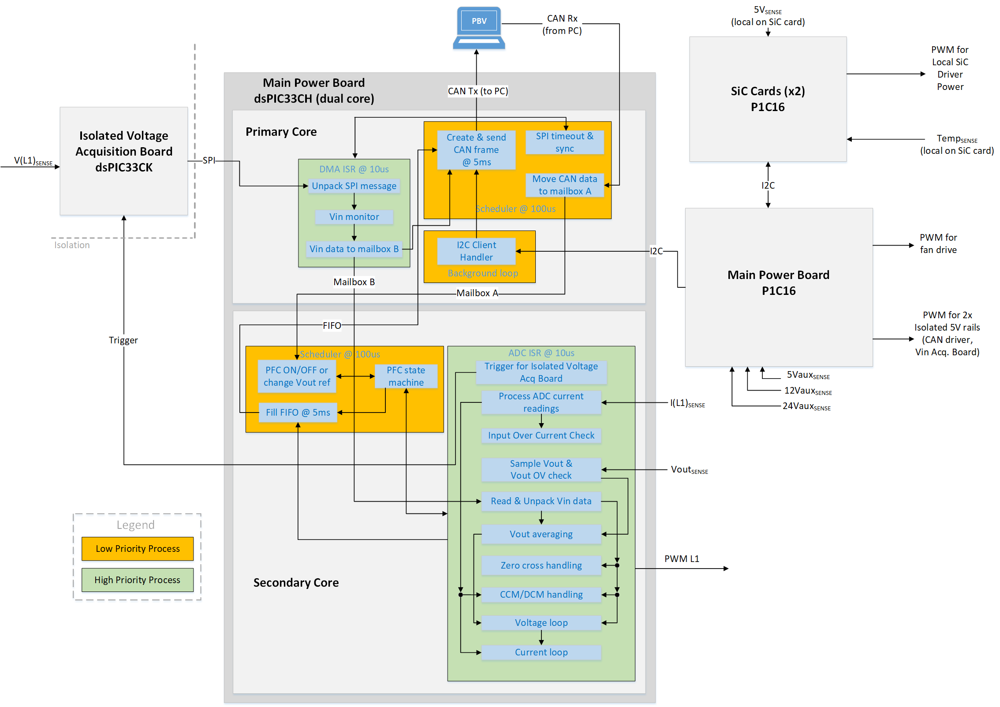
</a>
</p>

| **Microcontroller** &nbsp;  | **Located on** | **Main Functions**|
| ----------------------- | ---------------------------------- |------------------------------------------------- |
| dsPIC33CK32MC102        | Isolated Voltage Acquisition Board| Measuring line voltage (L1) with 12-bit ADC   |
|                         | | Measuring AC sense offset with 12-bit ADC |
|                         | |Sending results to dsPIC33CH on power board via SPI|
||||
| dsPIC33CH512MP506 Primary Core   | Power Board                        | Communication handling (I2C, CAN, SPI)|
|                             |                            | AC input voltage monitoring|
||||
| dsPIC33CH512MP506 Secondary Core | Power Board                        | PFC control     |
||||
| PIC16F15323                       | Power Board                        | Aux rail monitoring      |
|                                  |                            | Fan speed control Push-pull PWM for 2x isolated 5V rails|
|                                  |                            | Gathering data from PIC16 on SiC cards via I2C|
|                                  |                            | Sending housekeeping data to dsPIC33CH via I2C |
||||
| PIC16F15323                       | SiC Card                           | Local voltage rail monitoring       |
|                                  |                            | Local Temperature Monitoring |
|                                  |                            | I2C client to PIC16 on main board |
||||

For more details about the internal workings of Isolated Voltage Acquisition board, and SiC cards, please refer to their respective documentation.

## Primary core  


<p>
<p>
<a target="_blank" rel="nofollow" href="images/firmware-primary.png">
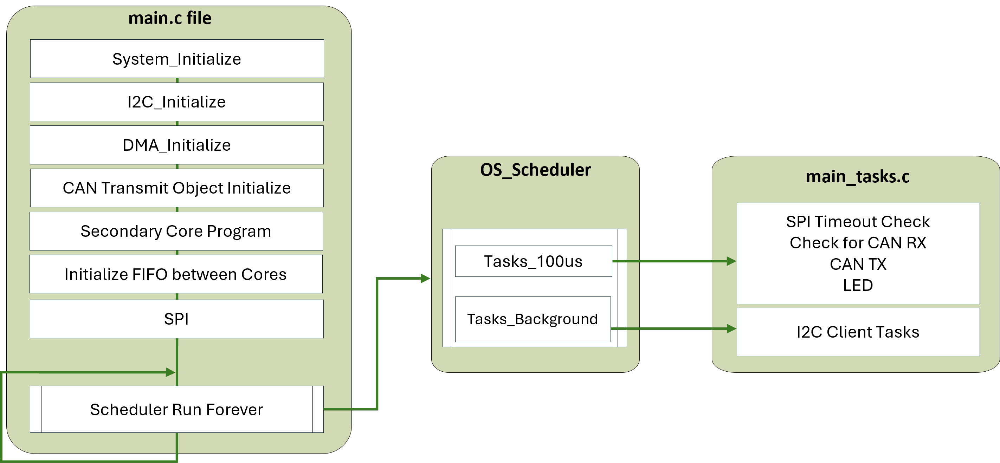
</a>
</p>

The main responibility of the core is line voltage sensing. It does so by receiving the SPI message from Isoloated Acquisiton board. It unpacks the message, and sends the data to the secondary core. 

The sequence of events is as follows

1.	dsPIC33CH secondary core (on PFC power board) sets digital output pin to trigger external interrupt on dsPIC33CK on Isolated Voltage Acquisition board. 
2.  Input voltage are measured with ADC, processed and sent to dsPIC33CH via SPI.
3.	DMA interrupt triggered on dsPIC33CH primary core upon receipt of 4x SPI words. Data is unframed.
4.	Finished processing of input voltage data. Send results to secondary core via mailbox B.
5.	dsPIC33CH secondary core reads mailbox B.

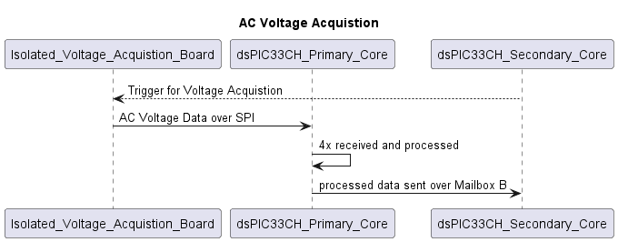

### Comms

Primary Cores handles all the commuincation. The commuincation is between

1. Mailbox commuincation between primary and secondary cores.
2. Various Housekeeping data from powerboard over I2C.
3. Analog Voltage Acquistion over SPI.
4. CAN-FD data to Power Board Visualizer

### Mailbox B data
Data sent from primary core to the secondary core of dspic33ch

| **word**   | **Description**                          | **comments**|
| :--       |:--------------                            | :--|
| 0         | Rectified ADC reading of phase 1 voltage  |       |
| 1         | Rectified ADC reading of phase 2 voltage  | not used in single phase implementation|
| 2         | Rectified ADC reading of phase 3 voltage  | not used in single phase implementation|
| 3         | Phase 1 voltage loop feedforward term     |       |
| 4         | Phase 2 voltage loop feedforward term     | not used in single phase implementation|
| 5         | Phase 3 voltage loop feedforward term     | not used in single phase implementation|
| 6         | Status Flags                              |       |
| 7         | Phase 1 average voltage                   |       |

The primary core also takes care of the CAN message framing and unframing to Power Board Visualizer, and I2C data processing from the Housekeeping PIC16.

## CAN-FD/Power Board Visualizer

All the commuincation done with the Power Board Visualizer is done over CAN-FD. Power Board Visualizer works only with PEAK CAN-FD USB dongle, and using 1/4 M bit rates. The messages to and from the PBV are documented in the Power Board Visualizer projects, and can be accessed through Info Tab.

## SPI data frame
For SPI data frame please refer to the Isolated Voltage Acquistion Board [Users Guide](https://microchip.com/70005524)

## I2C 

The format of the I2C write to the dsPIC33CH device is shown in Table below. The dsPIC33CH has a hardcoded I2C address of 0x20. The dsPIC33CH is configured in I2C client mode.

|     Byte number    |     Description                                                                                                                                                                                                                                                                                                                                                        |
|--------------------|------------------------------------------------------------------------------------------------------------------------------------------------------------------------------------------------------------------------------------------------------------------------------------------------------------------------------------------------------------------------|
|     0              |     Command ID (0x43)                                                                                                                                                                                                                                                                                                                                                  |
|     1              |     Bits 7:6 -> SiC card 4 status flags\n     Bits 5:4 -> SiC card 3 status flags\n     Bits 3:2 -> SiC card 2 status flags\n     Bits 1:0- > SiC card 1 status flags\n           Status flags decoder     0: no fault     1: 5V rail on SiC card has OV fault     2: 5V rail on SiC card has UV faul     3: comms error (I2C master could not communicate   with SiC card)    |
|     2              |     Temperature read from SiC card 1 in °C (max = 127,   min = -128)                                                                                                                                                                                                                                                                                                   |
|     3              |     Temperature read from SiC card 2 in °C                                                                                                                                                                                                                                                                                                                             |
|     4              |     Temperature read from SiC card 3 in °C                                                                                                                                                                                                                                                                                                                             |
|     5              |     Temperature read from SiC card 4 in °C                                                                                                                                                                                                                                                                                                                             |
|     6              |     Aux rail fault flags\n     Bits 7 and 6: not used\n     Bit 5: 24V UV\n         Bit 4: 24V OV\n         Bit 3: 12V UV\n         Bit 2: 12V OV\n         Bit 1: 5V UV\n          Bit 0: 5V OV                                                                                                                                                                                     |
|     7              |     Fan drive duty cycle (min = 0, max = 100)                                                                                                                                                                                                                              

## FIFO

Secondary Core sends a trigger every 5ms through a FIFO to primary core which triggers the Primary to send out a status message over CAN-FD to Power Board Visualizer.

## Secondary core 


<p>
<p>
<a target="_blank" rel="nofollow" href="images/firmware-secondary.png">
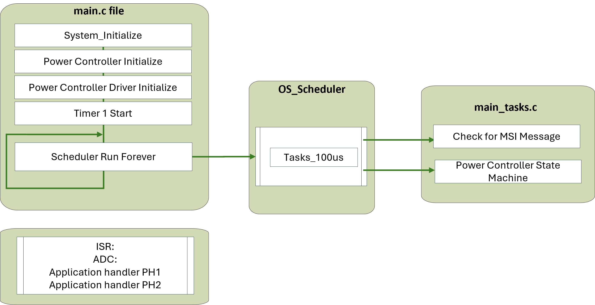
</a>
</p>

The secondary core is responsible for controlling the power stage of the PFC/GTI.

## Power Converter State Machine

This state machine is updated every 100us. 


<p>
<p>
<a target="_blank" rel="nofollow" href="images/state.png">
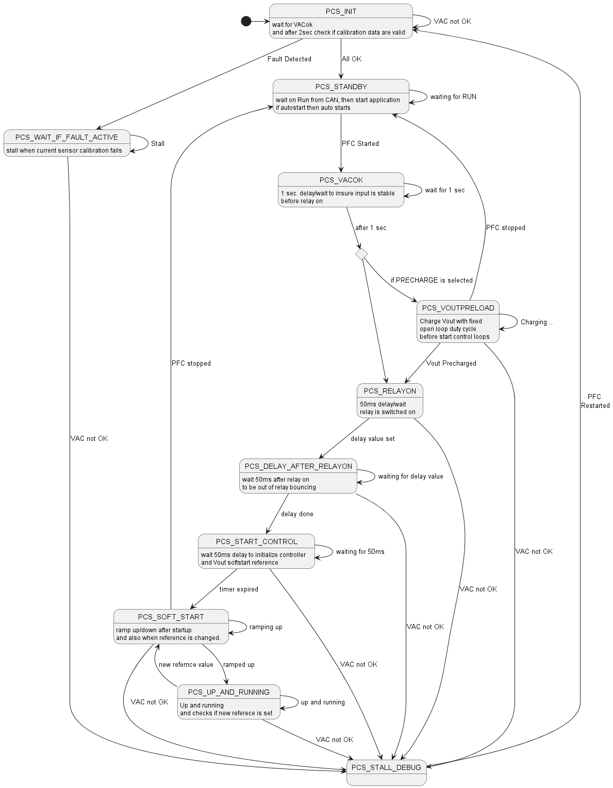
</a>
</p>

__PCS_INIT State__:
Power controller waits in this state until the Line Voltage is determined to be ok. Afterwards, it calibrates the input current sensor. 

__PCS_WAIT_IF_FAULT_ACTIVE State__:
If the current sensor calibration fails, then jump to this state. Here it stalls, and the system would have to be restarted to get out of this state.

__PCS_STANDBY State__:
Iniitalize PFC status flags and Waits for start PFC message.  and then starts application. if AUTO_START option is defined then application starts immediately. 

__PCS_VACOK State__:
Adding a delay of 1 second, ensuring that the input is stable before turning on the relays. 

__PCS_VOUT_PRELOAD State__:
Charge Vout with fixed open loop duty cycle before start control loops. This is Needed to prevent startup over current shoots because of greater difference Vin_peak greater Vout.

__PCS_RELAYON State__:
Turn on the Relay (bypassing NTCs). 

__PCS_DELAY_AFTER_RELAYON State__:
Wait in this state for 50ms to be safetly out of relay bouncing. 

__PCS_START_CONTROL State__:
In this state history of the control loops are cleared and Set loop ref = measured voltage / current
In this state, wait 50ms delay to initialize controller and Vout softstart reference based on the actual Vout measurement. Delay is needed to be sure that Vout is ramped up after PWM started switching

__PCS_SOFT_START State__:
Linearly ramp voltage loop reference to setpoint. During this stage voltage is ramped up/down after startup or when the reference is changed. 

__PCS_UP_AND_RUNNING State__:
The System is up and running. In this state, the referernce point can be changed from the PBV GUI. If the reference is changed it goes back to softstart. 

__PCS_STALL_DEBUG State__:
Debug State. If line voltage is bad, then jump into this state. Requires a reset to the machine.

## Application Handler

Along with the statemachine, Application Handler runs at 10us. The responibilities of this application handler is phase specific functionality to drive and control the totempole bridgeless topology. 


<p>
<p>
<a target="_blank" rel="nofollow" href="images/handler2.png">
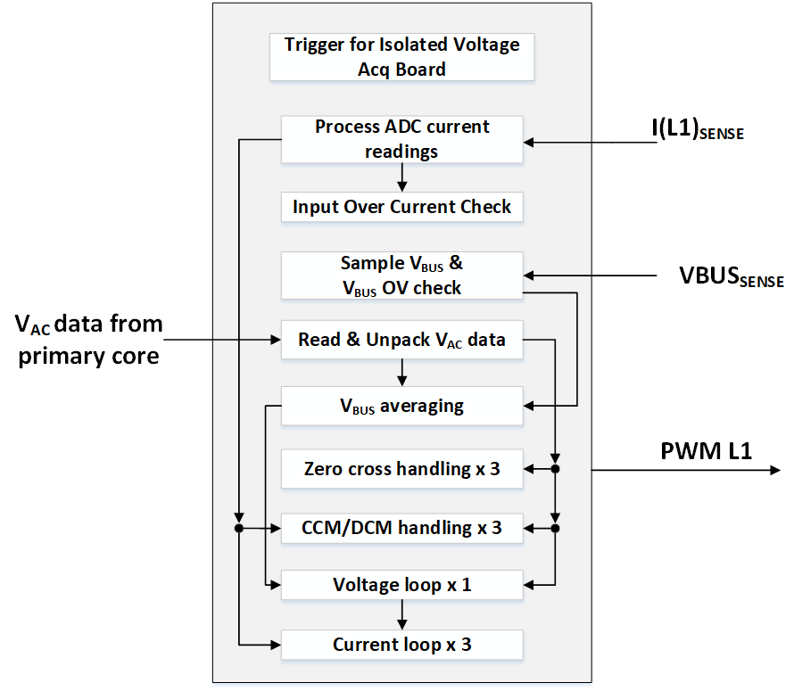
</a>
</p>


## Control

The Primary function of the PFC is to control the input current to follow the input voltage and the secondary function is to regulate the output voltage. The PFC runs in average current control mode.  In the control diagram, the term Vac/VRMS^2 is very important as it shapes the reference for the current loop. The output of the voltage loop scales the current loop reference based on the load/demand. 

The current loop is ran every pwm cycle at 10us, and the voltage loop is ran twice the grid frequency, so for 50Hz it runs at 100Hz.

In grid tied inverter there is only internal current loop, and the voltage loop is not present. I AC RMS setpoint is set from power board visualizer.


<p>
<p>
<a target="_blank" rel="nofollow" href="images/Complete.png">

</a>
</p>

<p>
<p>
<a target="_blank" rel="nofollow" href="images/inverter_control_hres.png">
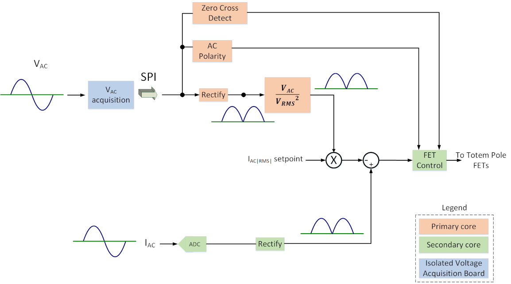
</a>
</p>

### DCDT

In this project, the [Microchip Digital Compensator Design Tool](https://www.microchip.com/en-us/development-tool/dcdt) has been employed for managing control loops. This software utility is specifically designed to aid engineers in the development and optimization of digital compensators for power supply systems. The tool streamlines the design process of digital control loops by offering an intuitive interface for configuring and tuning compensators.

This tool generates control loop files that are essential for code development. These files can be found in the directory pwrctrl/dcdt. In the file drv_controlle_TPBLPFC.c, users need to initialize the A- and B- coefficients of the control loop from DCDT, as well as set the scaling and limits for the control loop output. The control loop compensator is executed within Application handler at 10us frequency.

### Adaptive Gain

The output of the voltage regulator reflects the load. To ensure optimum THD even at low loads, the gain of the current regulator must be adapted. The basic setting of the coefficients is made at a gain of 10. This means that a gain of 1 results in a multiplication factor of 0.1. This procedure was chosen because our fixed point engine can easily process q15 values (value range 0-1). The gain factor is multiplied by all B-coefficients. For this purpose, the 2p2z assembler code was extended with a multiplication in the numerator.
The corresponding gain factors for certain load cases were measured in the application. For this purpose, a special firmware was used in which the gain factor can be set using the Powerboard Visualizer slider. The gain factors determined with this test setup are used to determine a linear equation for the load-dependent gains.

<p>
<p>
<a target="_blank" rel="nofollow" href="images/adaptive_control.png">
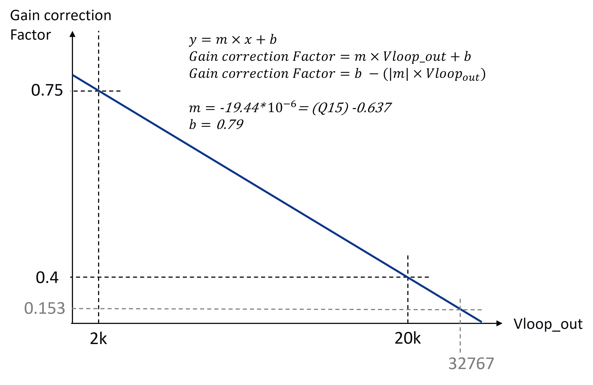
</a>
</p>

## Interleaved Operation

<p>
<p>
<a target="_blank" rel="nofollow" href="images/topology_interleaved.png">
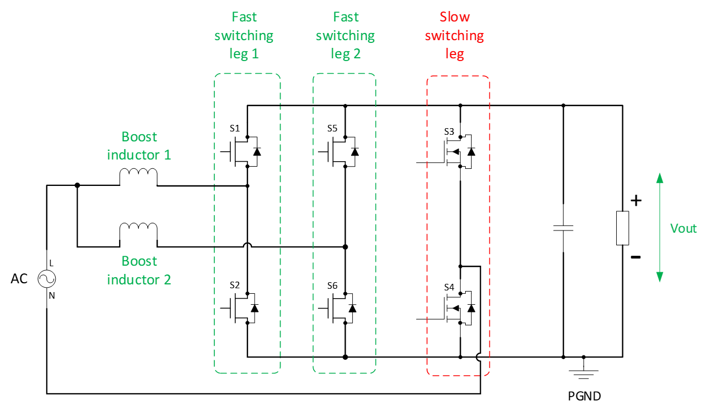
</a>
</p>


In Interleaved PFC mode, an additional current loop is used. The rest of the control mechanism and strategy is the same as the single phase pfc. 

<p>
<p>
<a target="_blank" rel="nofollow" href="images/interleaved_control.png">
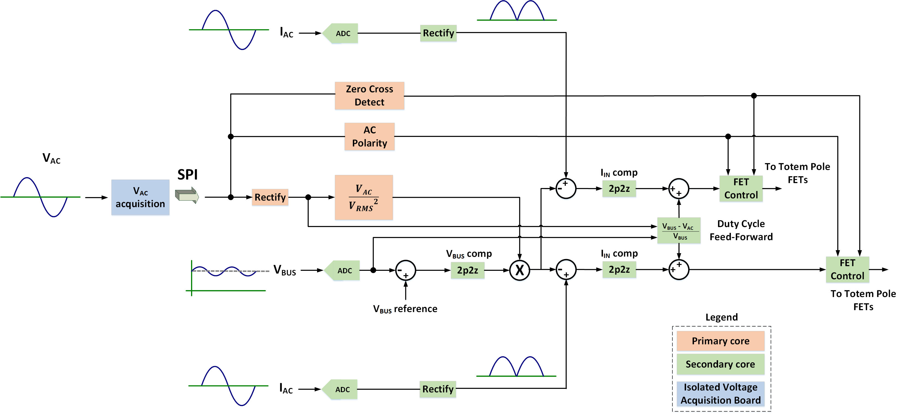
</a>
</p>


## Modes of Operation 

The same code base works with all the modes. The selection between different operation modes is done at the compile time.

### Available Modes and Recompiling

The project can be configured in six different configurations

- High Voltage PFC and Low Voltage PFC  
- High Volage Grid Tied Inverter and Low Voltage Grid Tied Inverter  
- High Voltage Interleaved PFC and Low Voltage Interleaved PFC  

When the project has high voltage flag enabled, a different compensator is used. Make sure that the correct voltage divider is being used on the hardware. Refer to the Users Guide/Operational Manual for more information.

### Totempole_Application_Setup.h

The same codebase works with all modes. Selection of the mode is done at compile time. To recompile the code in a different mode open the file sources_common/Totempole_Application_Setup.h and comment out the mode in which you want to compile the project. 

In the following code snippet, taken from the Totempole_Application_Setup.h header file, the project is configured to run in low voltage PFC mode. 

```
#define HIGH_VOLTAGE 0

#define MODE_PFC
//#define MODE_GRID_TIE_INVERTER
//#define MODE_INTERLEAVED
```

## Peripheral Setup and MCC

The peripherals are configured using Microchip Code Configurator (MCC). MCC provides an intuitive and easy way to configure peripherals. MCC comes preinstalled in the MPLAB X IDE and can be accessed from the MPLAB X IDE Toolbar. 

Since there are two cores, each core has its corresponding firmware project. To view the peripheral configuration of any core, set the relevant project as main project, and then click on MCC icon in the toolbar to view the details of that core. 

To learn more about Microchip Code Configurator Please visit the [webpage](https://www.microchip.com/en-us/tools-resources/configure/mplab-code-configurator).
