## Appendix to Operational Manual

### AC_N/Charge Pump

__Y-Capacitors Common Mode Noise Challenge:__

AC_N voltage alternates between Vout and PGND depending on AC polarity.  
During the positive half-wave, PWM_L_L1 is the active switch and PWM_L_N connects N to PGND.  
During the negative half-wave, PWM_H_L1 is the active switch and PWM_H_N connects N to Vout.  

The big issue here is re-distributing the charge between CY-PFC and CY-LOAD as we go from negative to positive AC (and also going from positive to negative AC) which results very large currents during switching, flowing in the common mode loop. This can cause EMI issues and also can cause distortion in the AC input current (between L and N) coming out of the zero crossing region. 

__How it works:__  
Current source formed operates in linear region. This will control the rate of charge re-distribution between the Y-caps. Note that the amount of time you need to turn this current source on for depends mainly on the Y-cap on the input side (assuming it is smaller than the Y-cap on the output side), as its all about charge re-distribution and this depends on the smallest Y-cap. Also Note that if measuring the potential between N and PGND for this proposed scheme (current sources to equalize charge on Y-caps until V(PE, PGND) = 0), we need to measure N at the point at which the wires connect to the board.

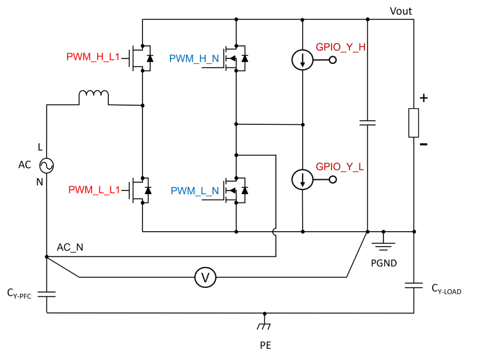

__AC Input going from ZC to negative halfwave__

The current source controlled by GPIO_Y_H charges the Y caps which are discharged to Vout before the PWM_H_L1 and PWM_H_N switches become active. With PWM_H_N the potential AC_N is connected to Vout so that this potential becomes close to Vout.


<p>
<center>
<p>
<a target="_blank" rel="nofollow" href="images/Charge_pump.png">
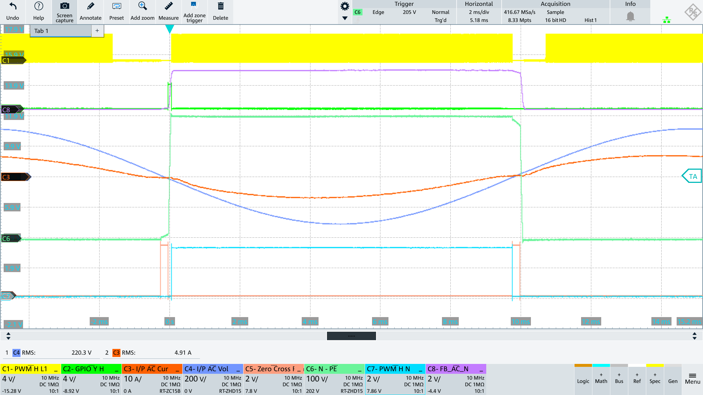
</a>
&nbsp;
<a target="_blank" rel="nofollow" href="images/charge_pump_marking.png"> 
</p>
</a>
</center>
</p>

<p>

<a target="_blank" rel="nofollow">
<b>
<ol type="A">
  <li>Zero Cross Region Started</li>
  <li>Zero Cross Region Ended and charge pump started</li>
  <li>Charge pump ends and normal switching starts</li>
</ol>
</b>
</a>
</p>


__AC Input going from ZC to positive halfwave__

The current source controlled by GPIO_Y_L discharges the y caps which are charged to Vout before the PWM_L_L1 and PWM_L_N switches become active. With PWM_L_N the potential AC_N is connected to PGND so that this potential becomes close to 0V.

```math
Polarity = positive
AC_N falls to 0V

AC_N > 13V -> ON
AC_N < 13V -> OFF
```

<p>
<p>
<a target="_blank" rel="nofollow" href="images/charge_pump_neg.png"> 
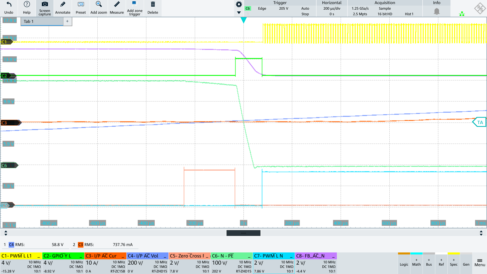</p>
</a>
</p>


__AC_N Level Check to Switch ON/OFF Current Source__


```math
Current Source ON
[Polarity = negative] AND [AC_N < 75% of Vout]
[Polarity = positive] AND [AC_N > 64V] 
(@HV: 64V ≙ 500digit) 
(@LV: 13V ≙ 500digit)


Current Source OFF
[Polarity = negative] AND [AC_N > 75% of Vout]
[Polarity = positive] AND [AC_N < 64V] 
(@HV: 64V ≙ 500digit) 
(@LV: 13V ≙ 500digit)
```

## PFC Waveforms
### PFC Startup

On startup, PFC precharges the output caps, and then maintains an output voltage by periodically turning on the fast switching legs in Burst Mode


<p>
<center>

<p>
<a target="_blank" rel="nofollow" href="images/pfc_start_no_load.png">
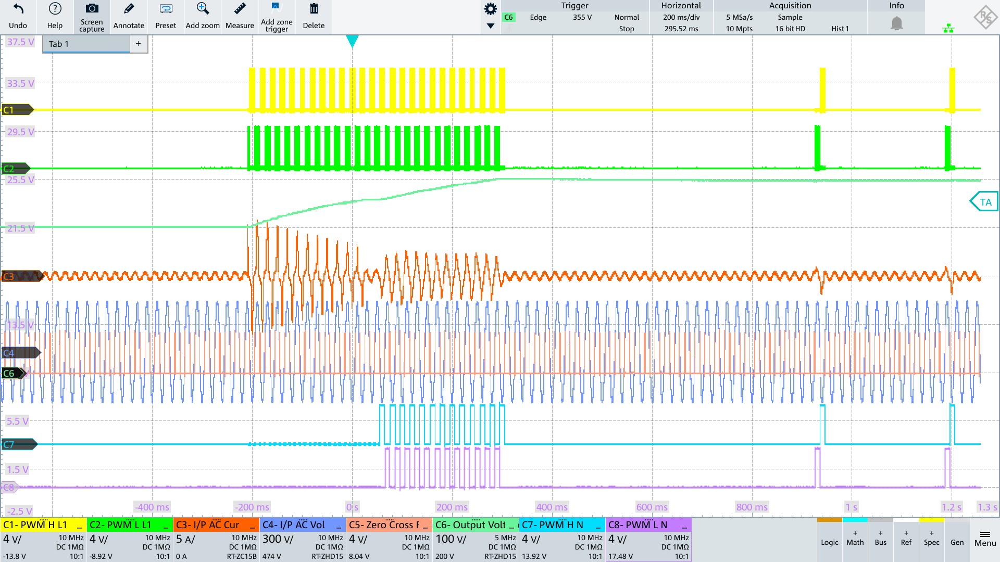
</a>

&nbsp;

<a target="_blank" rel="nofollow" href="images/waiting_for_start.png">
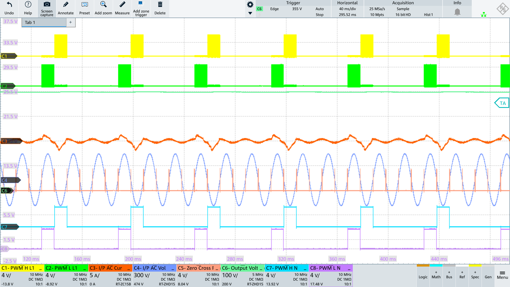
</a>
</p>

</center>
</p>

<p>
<center>
<a target="_blank" rel="nofollow">
<b>
PFC at Startup with no load. AS soon as the reference output voltage is acheived, the PFC starts working in burst mode to maintain the output voltage.
</b>
</a>
</center>
</p>


### PFC reaction to load transients

<p>
<center>
<a target="_blank" rel="nofollow" href="images/load_transient_turning_on.png">
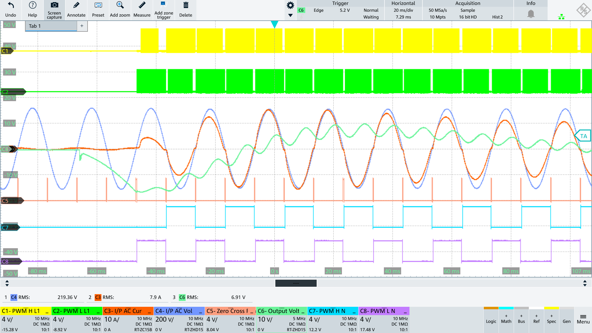
</a>
</center>
</p>
  
<p>
<center>
<a target="_blank" rel="nofollow">
<b>
PFC Load Transient during turning on. Channel C6 Output Voltage is AC coupled.
</b>
</a>
</center>
</p>


<p>
<center>
<a target="_blank" rel="nofollow" href="images/load_transient_turning_off_3.png">
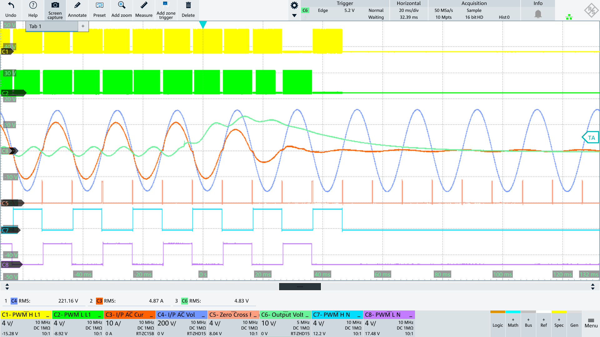
</a>
</center>
</p>
  
<p>
<center>
<a target="_blank" rel="nofollow">
<b>
PFC Load Transient during turning off. Channel C6 Output Voltage is AC coupled.
</b>
</a>
</center>
</p>


### PFC Interleaved


<p>
<center>
<p>
<a target="_blank" rel="nofollow" href="images/interleaved/interleaved_normal.png">
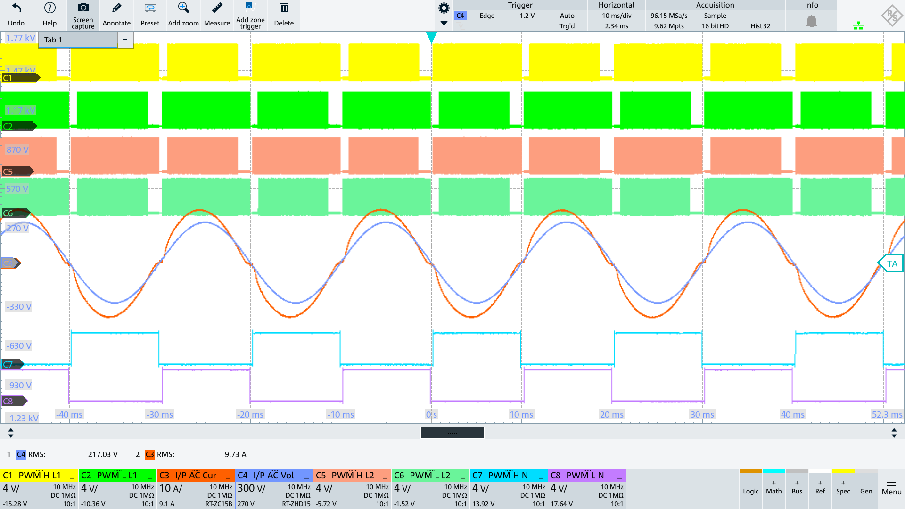
</a>
&nbsp;
<a target="_blank" rel="nofollow" href="images/interleaved/interleaved_normal_one.png"> 
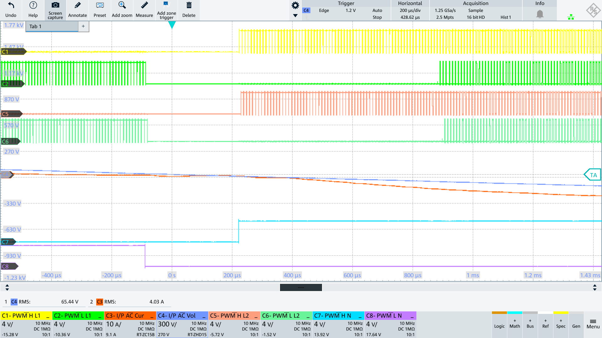</p>
</a>
</center>
</p>
  

<p>
<center>
<a target="_blank" rel="nofollow">
<b>
Interleaved Operation
</b>
</a>
</center>
</p>


<p>
<center>
<p>
<a target="_blank" rel="nofollow" href="images/interleaved/interleaved_normal_two.png">
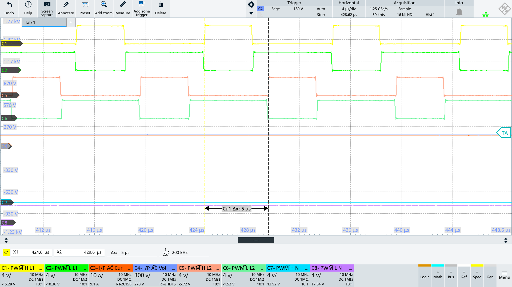
</a>
</center>
</p>
 

<p>
<center>
<a target="_blank" rel="nofollow">
<b>
Interleaved Operation Zoomed in to show how the PWM interleaving works
</b>
</a>
</center>
</p>


## Grid Tied Inverter Waveforms

<p>
<center>
<p>
<a target="_blank" rel="nofollow" href="images/GTI/GTI_waveform.png">
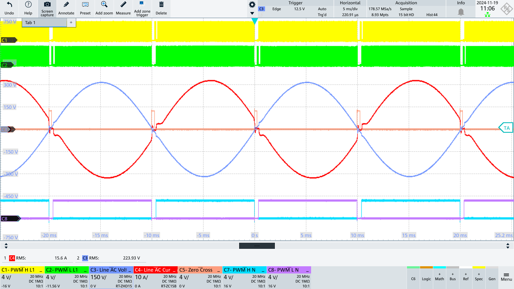
</a>
</center>
</p>
 
<p>
<center>
<a target="_blank" rel="nofollow">
<b>
Grid Tied Inverter Current and Voltage Waveforms
</b>
</a>
</center>
</p>
