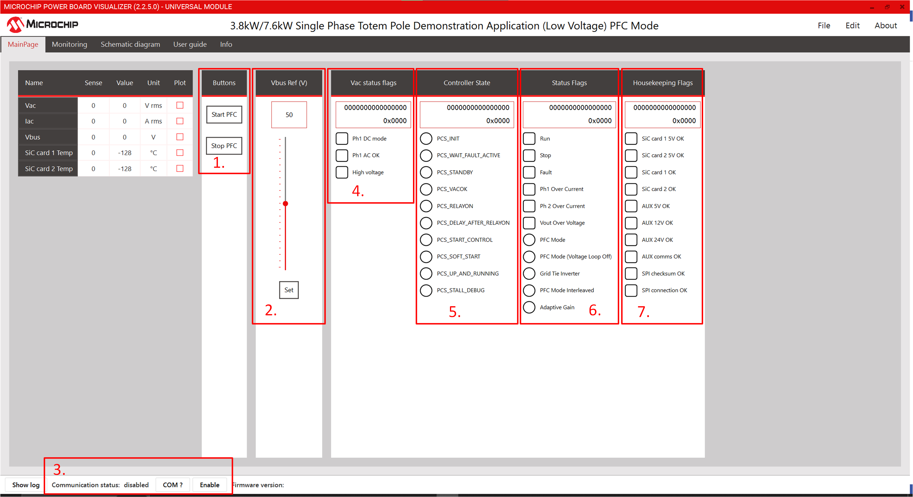
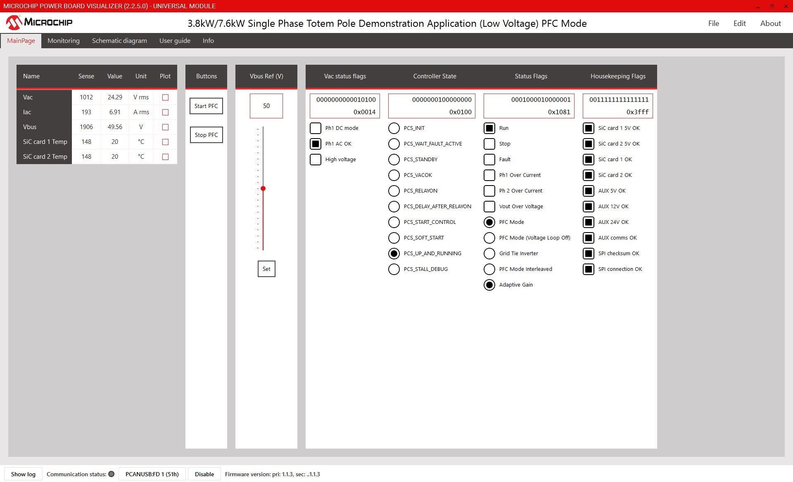
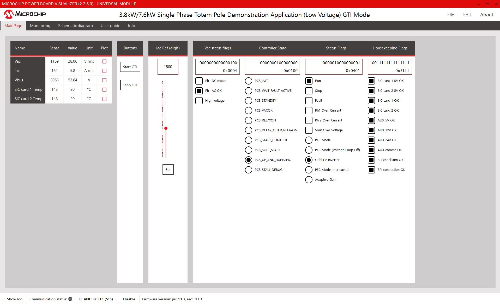
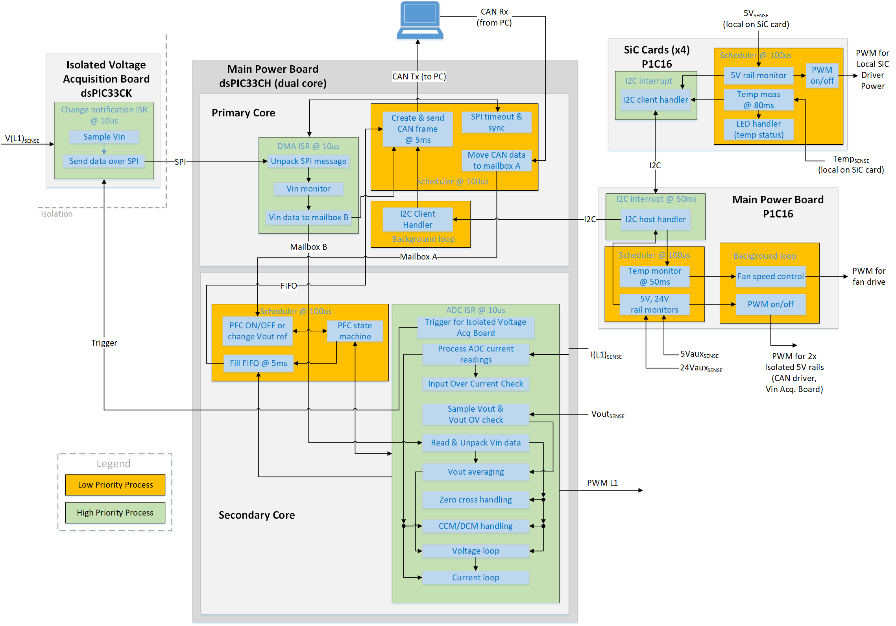
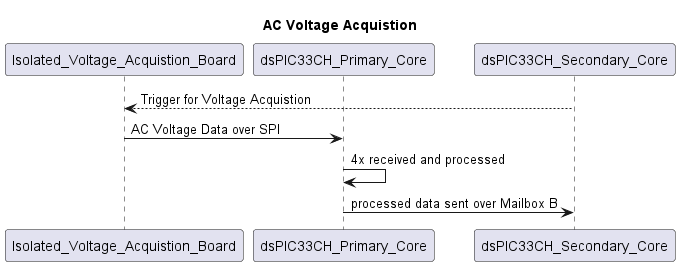
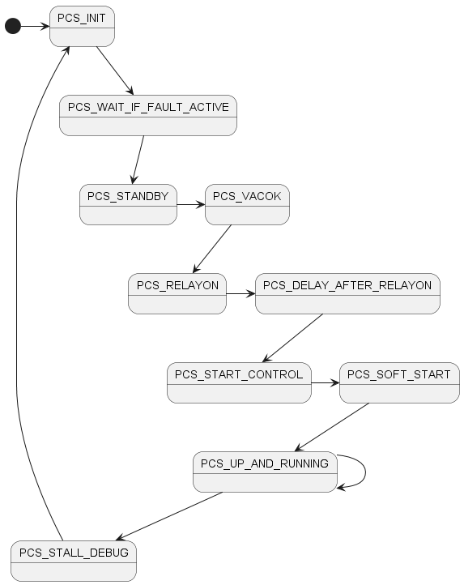

---
# 3.8kW / 7.6kW dsPIC33C Totem Pole Demonstration Application
<p>
  <center>
     
    <br>
    3.8kW / 7.6 kW dsPIC33 Totem Pole - UPDATE (wait for milan)
  </center>
</p>


## Table of Contents
  - [Introduction/Summary](#introductionsummary)
  - [Highlights](#highlights)
  - [Related Collaterals](#related-collaterals)
    - [Hardware Used](#hardware-used)
    - [Software Used](#software-used)
  - [Directory Structure](#directory-structure)    
    -[Programming the Digital Power Development Plug in Module (DP-PIM)](#programming-hex-file-using-available-hex-files)    
    -[Recompiling the code](#available-modes-and-recompiling)
  - [Quick Start Guide](#quick-start-guide)  
    -[Hardware Setup](#hardware-setup)  
    -[Powering On Board](#powering-on-board-through-power-board-visualizer)  
  - [Firmware Overview](#firmware-overview)  
    -[Controllers in the system](#microcontrollers)  
    -[States](#state-machine-overview)  
    -[Messages](#messages-to-and-from-the-system)  

## Introduction/Summary

The dsPIC33C Totem Pole Demonstrator platform, based on Microchips dsPIC33C and Silicon Carbide (SiC) devices, supports rapid prototyping and code development for high voltage Single Phase PFC/Grid Tied Inverters(GTI). The primary target application is automotive On-board chargers (OBC), but it can be used for any other industrial or telecom application that requires high power PFC/GTI.  

This readme aims to provide a quick start guide in controlling and running the PFC and GTI, once the hardware is setup and electrical connections are made.

## Highlights

- Supports the following operating modes at both low voltage and high voltage 
  - Single phase PFC with two legs interleaved
  - Single phase voltage inverter
  - Forward operation, current mode
- CAN communication to PC running Power Board Visualizer GUI
- SPI communication to Isolated Voltage Acquisition Board
- I2C communication to PIC16 on main power board (for housekeeping)

## Related Collaterals
### Hardware Used

- dsPIC33C Totem Pole PFC Development Platform
  - Power Board
  - Isolated Voltage Acquisition Board
  - SiC FET PIM
  
**Hardware Documentation**

- dsPIC33C Totem Pole PFC Development Board User's Guide
- Isolated Voltage Acquisition Board User’s Guide
- SiC FET Plug-In Module (SiC FET PIM) User’s Guide
- Operational Manuals

**Target Device Documentation**

- [dsPIC33CH512MP506 Family Data Sheet](https://www.microchip.com/en-us/product/dsPIC33CH512MP506)
- [dsPIC33CH512MP506 Family Silicon Errata and Data Sheet Clarification](https://ww1.microchip.com/downloads/en/DeviceDoc/dsPIC33CH512MP508-Family-Silicon-Errata-and-Data-Sheet-Clarification-DS80000805K.pdf)

**Please always check for the latest data sheets on the respective product websites:**

- [dsPIC33CH512MP508 Family](https://www.microchip.com/dsPIC33CH512MP508)

## Software Used

- [MPLAB&reg; X IDE v6.20](https://www.microchip.com/mplabx-ide-windows-installer)
- [MPLAB&reg; XC-DSC Compiler v3.00](https://www.microchip.com/en-us/tools-resources/archives/mplab-ecosystem)
- [Microchip Code Configurator v5.7.0](https://www.microchip.com/mplab/mplab-code-configurator)
- [MPLAB® PowerSmart™ Development Suite](https://www.microchip.com/en-us/solutions/power-management-and-conversion/intelligent-power/mplab-powersmart-development-suite)
- [Digital Compensator Design Tool](https://www.microchip.com/developmenttools/ProductDetails/DCDT)

[Back to Contents](#table-of-contents)

## Directory Structure

Note that there are two MPLABx projects associated with this deployment, one for the primary core and one for the secondary core.

```
├───dspic33ch_totem_pole_single_phase_primary.X      dspic33ch512mp506 Primary core Project
├───dspic33ch_totem_pole_single_phase_secondary.X    dspic33ch512mp506 Secondary core Project
├───images                                           Images for the Readme
├───power_board_visualizer_xmls                      Power Board Visualizer Projects
├───pre_compiled_hex_files                           Pre compiled Hex files for PFC and GTI modes
└───sources_common                                   Common Sources between both primary and secondary projects
```
  
[Back to Contents](#table-of-contents)
## Programming Hex File using available hex files

In this example ICD4 is being used, but any of the available debuggers/programmers can be used.

1. Open MPLAB X IPE
2. Select the device on DP-PIM : dsPIC33CH512MP506 (not S1)  
3. Memory Model : Single Partition
4. Connect computer to ICD4 via USB cable, connect ICD4 to 6 pin header on DP-PIM via RJ11 cable and RJ11 to ICSP adapter.
5. Power the dpPIM through a microUSB cable. 
6. Click connect on the MPLAB X IPE
7. Wait for the device to connect
8. Navigate to the folder pre_compiled_hex_files, and select the correct hex file
9. Click program
10. Wait for the program/verify complete message. 
11. Disconnect programmer from Digital Power Plug-in Module.    
  
[Back to Contents](#table-of-contents)
## Available Modes and Recompiling

The project can be configured in six different configurations,  
High Voltage PFC and Low Voltage PFC  
High Volage Grid Tied Inverter and Low Voltage Grid Tied Inverter  
High Voltage Interleaved PFC and Low Voltage Interleaved PFC  

When the project has high voltage flag enabled, a different compensator is used. Make sure that the correct voltage divider is being used on the hardware. Refer to the Users Guide/Operational Manual for more information.

[Back to Contents](#table-of-contents)

### Header files

#### Totempole_Application_Setup.h

The same codebase works with all modes. To recompile the code in a different mode open the file sources_common/Totempole_Application_Setup.h and comment out the mode in which you want to compile the project. 

In the following code snippet, taken from the Totempole_Application_Setup.h header file, the project is configured to run in low voltage PFC mode.

```
#define HIGH_VOLTAGE 0

#define MODE_PFC
//#define MODE_GRID_TIE_INVERTER
//#define MODE_INTERLEAVED
```

[Back to Contents](#table-of-contents)

# Quick Start Guide 

This Section will guide you on how to run and control the PFC or GTI application using power board visualizer, once the electrical connections are made.

## Hardware Setup

Please refer to the operational manual on PFC hardware setup considerations. Ensure the correct load and source selection has been made. This readme does not cover the electrical setup for the Totempole Application board.

To enable the CAN commuincation from the PC to Totem pole application board a USB to CAN dongle is needed. Note that the Power Board Visualizer can only work with PEAK System USB CAN-FD dongles. You can use a RS232 DB9 Straight Through cable to connect the Totempole board to PEAK dongle.

<p>
  <center>
     
    <br>
    3.8kW / 7.6 kW dsPIC33 Totem Pole PFC Hardware Setup Overview
  </center>
</p>


<p>
  <center>
     
    <br>
    3.8kW / 7.6 kW dsPIC33 Totem Pole GTI Hardware Setup Overview
  </center>
</p>


[Back to Contents](#table-of-contents)

## Powering On board through Power Board Visualizer

### Prequisites
Following software must be installed on your pc to control/communicate between Power Board Visualizer and dsPIC33CH. 

- [Power Board Visualizer V2](https://www.microchip.com/en-us/software-library/power_board_visualizer)
- [Peak System USB Drivers](https://www.peak-system.com/Drivers.523.0.html?&L=1&gad_source=1&gclid=EAIaIQobChMI45n6jYW1hQMVgBatBh3uEgOhEAAYASAAEgJEm_D_BwE)

### Setting up and Connecting the Power Board Visualizer

Once the hardware setup is all done, Navigate to the power board visualizer xmls folder. Open the relevant project using Power Board Visualizer. Here PFC mode is taken as an example. Once the project is open you will be greeted by the following screen.  

The basic unit of commuincation for Power board Visualizer is unsigned 16 bits. Each message sent and received, therefore, consists of words(16bits). For more information refer to the Power Board Visualizer's [users guide](https://www.microchip.com/en-us/software-library/power_board_visualizer).

<p>
  <center>
     
    <br>
    PFC project running on Power Board Visualizer GUI 
  </center>
</p>

#### 1. Start Stop Button   
This button turns on and off the application. Each button corresonds to a message over CANFD. Click on Info tab for CAN message description.

#### 2. Vout/Iout Ref Slider
This slider is used to set a output voltage/current referece for the PFC/GTI. Its important to press Set button underneath the slider to communicate the reference value to the micrcontroller. 

#### 3. Comm Status and COM Selector

The "COM?" button lists all the available commuincation ports available to the PBV. If the Peak Dongle drivers are installed and the Peak USB dongle is connected to the system, then you will see the Peak USB dongle listed here as PCAN_USB:FD. Select the right port and then click enable. Power Board Visualizer will then open the Comm port.

#### 4. Vac Status Flags

This Status group lists the Line AC voltage Status word. 

#### 5. PFC Controller State

This controller status group communicates the current state of the system. More information on what each state does, and statemachine can be found in [state machine overview](#state-machine-overview) in detail. 

#### 6. PFC Status Flags

This Status flag group lists the current mode, and highlevel state of the system. 

#### 7. Housekeeping Flags  

Thie status group lists the health and communication of SiC cards, as well as the Auxillary supplies.

[Back to Contents](#table-of-contents)

## Sequence of Actions to Power On

After opening the right Power board Visualizer Project, following sequence of actions are to be taken to start the board

1. Select the right comm port and enable the port. 
2. If everything is setup correctly, you will see some status/housekeeping data, and the system in PCS_STANDBY state.
3. Change reference voltage/current if you want to. 
4. Click on Start. The system will jump quickly through the states, and then should land on PCS_UP_AND_RUNNING.

<p>
  <center>
     
    <br>
     PFC Up and Running
  </center>
</p>

<p>
  <center>
     
    <br>
     GTI Up and Running
  </center>
</p>


[Back to Contents](#table-of-contents)

# Firmware Overview

dspic33CH Peripheral Setup is done through [Microchip Code Configurator](https://www.microchip.com/mplab/mplab-code-configurator). 

## Microcontrollers

The main microcontrollers used in this project that are central to the PFC operation are

-	A dsPIC33CK on the Isolated Voltage Acquisition Board
-	A dsPIC33CH (dual core) on the main power board  

There are also two PIC16 microcontrollers used for housekeeping functions.   

-	A PIC16 on the main power board
-	A PIC16 on each SiC card

See the following for an illustration of the processes running on the different microcontrollers. Note that for all microcontrollers, only two priority levels are used. The higher priority interrupt-driven processes are show in green and the lower priority background processes are shown in orange. Any schedulers are driven by polling timer overflow/interrupt flags in the background loop, and are interrupted by the higher priority processes. 

<p>
  <center>
     
    <br>
    Overview of microcontrollers in the system
  </center>
</p>


| **Microcontroller** | **Located on** | **Main Functions**|
| --------------------| ---------------------------------- |------------------------------------------------- |
| dsPIC33CK32MC102   | Isolated Voltage Acquisition Board | Measuring line voltage (L1) with 12-bit ADC<br>Measuring AC sense offset with 12-bit ADC<br>Sending results to dsPIC33CH on power board via SPI                     |
| dsPIC33CH512MP506 Primary Core   | Power Board                        | Comms handling (I2C, CAN, SPI)<br>AC input voltage monitoring                                                                                                                    |
| dsPIC33CH512MP506 Secondary Core | Power Board                        | PFC control     |
| PIC16F15323                       | Power Board                        | Aux rail monitoring<br>Fan speed control<br>Push-pull PWM for 2x isolated 5V rails<br>Gathering data from PIC16 on SiC cards via I2C<br>Sending housekeeping data to dsPIC33CH via I2C |
| PIC16F15323                       | SiC Card                           | Local rail monitoring<br> Local Temperature Monitoring<br> I2C client to PIC16 on main board |

Please refer to the users guide of Isoloated Voltage Acquisiton board for indepth understanding. 

## Primary core

The main responibility of the core is line voltage sensing. It does so by receiving the SPI message from Isoloated Acquisiton board. It unpacks the message, and sends the data to the secondary core. 

The sequence of events is as follows

1.	dsPIC33CH secondary core (on PFC power board) sets digital output pin to trigger external interrupt on dsPIC33CK on Isolated Voltage Acquisition board. 
2.  Input voltage are measured with ADC, processed and sent to dsPIC33CH via SPI.
3.	DMA interrupt triggered on dsPIC33CH primary core upon receipt of 4x SPI words. Data is unframed.
4.	Finished processing of input voltage data. Send results to secondary core via mailbox B.
5.	dsPIC33CH secondary core reads mailbox B.


<p>
  <center>
     
    <br>
     AC Voltage Acquistion Sequence
  </center>
</p>

### Mailbox B data
Data sent from primary core to the secondary core of dspic33ch

| **word**   | **Description**                                         | **comments**|
| :--       |:--------------                                           | :--|
| 0         | Rectified ADC reading of phase 1 voltage        ||
| 1         | Rectified ADC reading of phase 2 voltage          | not used|
| 2         | Rectified ADC reading of phase 3 voltage          | not used|
| 3         | Phase 1 voltage loop feedforward term             | |
| 4         | Phase 2 voltage loop feedforward term             | not used|
| 5         | Phase 3 voltage loop feedforward term      | not used|
| 6         | Status Flags ||
| 7         | Phase 1 average voltage ||

The primary core also takes care of the CAN message framing and unframing, and I2C data pricessing from the Housekeeping PIC 16.

## Secondary core

The secondary core is responsible for controlling the power stage of the PFC/GTI.

[Back to Contents](#table-of-contents)
## State Machine Overview

<p>
  <center>
     
    <br>
    main function of the primary core
  </center>
</p>

### PCS_INIT State

Power controller waits in this state until the Line Voltage is determined to be ok. Afterwards, it calibrates the input current sensor. 

### PCS_WAIT_IF_FAULT_ACTIVE State

If the current sensor calibration fails, then jump to this state.

### PCS_STANDBY State

Iniitalize PFC status flags. Wait for start PFC message
### PCS_VACOK State
Adding a delay of 1 second.
### PCS_RELAYON State
Turn on the Relay (bypassing NTCs)

### PCS_DELAY_AFTER_RELAYON State
Wait in this state for 50ms. 

### PCS_START_CONTROL State
In this state history of the control loops are cleared and Set loop ref = measured voltage / current
### PCS_SOFT_START State

Linearly ramp voltage loop reference to setpoint.

### PCS_UP_AND_RUNNING State
The System is up and running. In this state, the referernce point can be changed from the PBV GUI.
### PCS_STALL_DEBUG State
Debug State. If line voltage is bad, then jump into this state.


## Power Board Visualizer/CAN-FD

All the commuincation done with the Power Board Visualizer is done over CAN-FD. Power Board Visualizer works only with PEAK CAN-FD USB dongle, and using 1/4 M bit rates. The messages to and from the PBV are documented in the Power Board Visualizer projects, and can be accessed through Info Tab.

[Back to Contents](#table-of-contents)