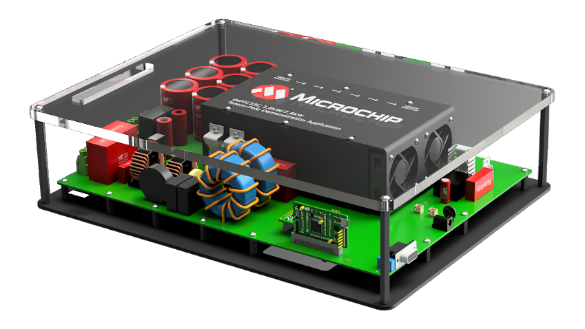
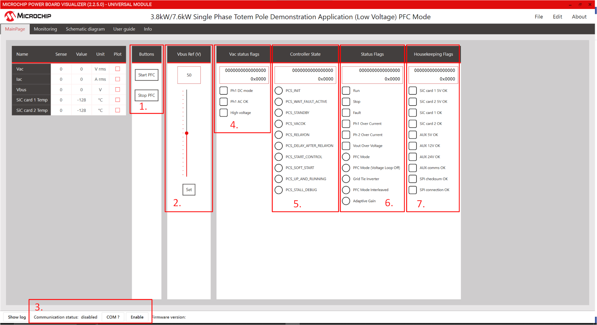

---
# 3.8kW / 7.6kW dsPIC33C Totem Pole Demonstration Application




## Introduction

The dsPIC33C Totem Pole Demonstrator platform, based on Microchips dsPIC33C and Silicon Carbide (SiC) devices, supports rapid prototyping and code development for high voltage Single Phase PFC/Grid Tied Inverters(GTI). The primary target application is automotive On-board chargers (OBC), but it can be used for any other industrial or telecom application that requires high power PFC/GTI.  

This readme aims to provide a quick start guide in controlling and running the PFC and GTI, once the hardware is setup and electrical connections are made. 

## Highlights

- Supports the following operating modes at both low voltage and high voltage 
  - Single phase PFC with two legs interleaved
  - Single phase voltage inverter
  - Forward operation, current mode
- CAN communication to PC running Power Board Visualizer GUI
- SPI communication to Isolated Voltage Acquisition Board
- I2C communication to PIC16 on main power board (for housekeeping)

## Related Collaterals

### Firmware Documentation

[Online Firmware Documentation of this Code Example](https://microchip-pic-avr-examples.github.io/dspic33ch-power-totem-pole-demonstration-application-single-phase/)


### Hardware Used

- dsPIC33C Totem Pole PFC Development Platform
  - Power Board
  - Isolated Voltage Acquisition Board
  - SiC FET PIM
  
**Hardware Documentation**

- dsPIC33C Totem Pole PFC Development Board User's Guide
- Isolated Voltage Acquisition Board User’s Guide
- SiC FET Plug-In Module (SiC FET PIM) User’s Guide
- Operational Manuals

**Target Device Documentation**

- [dsPIC33CH512MP506 Family Data Sheet](https://www.microchip.com/en-us/product/dsPIC33CH512MP506)
- [dsPIC33CH512MP506 Family Silicon Errata and Data Sheet Clarification](https://ww1.microchip.com/downloads/en/DeviceDoc/dsPIC33CH512MP508-Family-Silicon-Errata-and-Data-Sheet-Clarification-DS80000805K.pdf)
- [dsPIC33CH512MP508 Family](https://www.microchip.com/dsPIC33CH512MP508)

**Please always check for the latest data sheets on the respective product websites:**

## Software Used

- [MPLAB&reg; X IDE v6.20](https://www.microchip.com/mplabx-ide-windows-installer)
- [MPLAB&reg; XC-DSC Compiler v3.10](https://www.microchip.com/en-us/tools-resources/archives/mplab-ecosystem)
- [Microchip Code Configurator v5.7.0](https://www.microchip.com/mplab/mplab-code-configurator)
- [MPLAB® PowerSmart™ Development Suite](https://www.microchip.com/en-us/solutions/power-management-and-conversion/intelligent-power/mplab-powersmart-development-suite)
- [Digital Compensator Design Tool](https://www.microchip.com/developmenttools/ProductDetails/DCDT)


## Directory Structure

Note that there are two MPLABx projects associated with this project, one for the primary core and one for the secondary core.

```
├───dspic33ch_totem_pole_single_phase_primary_IL.X      dspic33ch512mp506 Primary core Project
├───dspic33ch_totem_pole_single_phase_secondary_IL.X    dspic33ch512mp506 Secondary core Project
├───images                                           Images for the Readme
├───power_board_visualizer_xmls                      Power Board Visualizer Projects
├───pre_compiled_hex_files                           Pre compiled Hex files for PFC and GTI modes
└───sources_common                                   Common Sources between both projects
```
  
  

## Programming Hex File using available hex files

In this example ICD4 is being used, but any of the available debuggers/programmers can be used.

1. Open MPLAB X IPE
2. Select the device on DP-PIM : dsPIC33CH512MP506 (not S1)
3. Memory Model : Single Partition
4. Connect computer to ICD4 via USB cable, connect ICD4 to 6 pin header on DP-PIM via RJ11 cable and RJ11 to ICSP adapter.
5. Power the dpPIM through a microUSB cable. 
6. Click connect on the MPLAB X IPE
7. Wait for the device to connect
8. Navigate to the folder pre_compiled_hex_files, and select the correct hex file
9. Click program
10. Wait for the program/verify complete message. 
11. Disconnect programmer from Digital Power Plug-in Module.    
  

## Quick Start Guide 

This Section will guide you on how to run and control the PFC or GTI application using power board visualizer, once the electrical connections are made.

## Hardware Setup

Please refer to the operational manual on PFC hardware setup considerations. Ensure the correct load and source selection has been made. This readme does not cover the electrical setup for the Totempole Application board.

To enable the CAN commuincation from the PC to Totem pole application board a USB to CAN dongle is needed. Note that the Power Board Visualizer can only work with PEAK System USB CAN-FD dongles. You can use a RS232 DB9 Straight Through cable to connect the Totempole board to PEAK dongle.


## Powering On board through Power Board Visualizer

### Prequisites
Following software must be installed on your pc to control/communicate between Power Board Visualizer and dsPIC33CH. 

- [Power Board Visualizer V2](https://www.microchip.com/en-us/software-library/power_board_visualizer)
- [Peak System USB Drivers](https://www.peak-system.com/Drivers.523.0.html?&L=1&gad_source=1&gclid=EAIaIQobChMI45n6jYW1hQMVgBatBh3uEgOhEAAYASAAEgJEm_D_BwE)

### Setting up and Connecting the Power Board Visualizer

Once the hardware setup is all done, Navigate to the power board visualizer xmls folder. Open the relevant project using Power Board Visualizer. Here PFC mode is taken as an example. Once the project is open you will be greeted by the following screen.  


](images/pbv_open_s.png)

#### 1. Start Stop Button   
This button turns on and off the application. Each button corresonds to a message over CANFD. Click on Info tab for CAN message description.

#### 2. Vout/Iout Ref Slider
This slider is used to set a output voltage/current referece for the PFC/GTI. Its important to press Set button underneath the slider to communicate the reference value to the micrcontroller. 

#### 3. Comm Status and COM Selector

The "COM?" button lists all the available commuincation ports available to the PBV. If the Peak Dongle drivers are installed and the Peak USB dongle is connected to the system, then you will see the Peak USB dongle listed here as PCAN_USB:FD. Select the right port and then click enable. Power Board Visualizer will then open the Comm port.

#### 4. Vac Status Flags

This Status group lists the Line AC voltage Status word. 

#### 5. PFC Controller State

This controller status group communicates the current state of the system. More information on what each state does, and statemachine can be found in [state machine overview](#state-machine-overview) in detail. 

#### 6. PFC Status Flags

This Status flag group lists the current mode, and highlevel state of the system. 

#### 7. Housekeeping Flags  

Thie status group lists the health and communication of SiC cards, as well as the Auxillary supplies.  


## Sequence of Actions to Power On

After opening the right Power board Visualizer Project, following sequence of actions are to be taken to start the board

1. Select the right comm port and enable the port. 
2. If everything is setup correctly, you will see some status/housekeeping data, and the system in PCS_STANDBY state. Confirm that the right operation Mode is programmed by looking at the Status Flags.
3. Change reference voltage/current if needed. 
4. Click on Start. The system will jump quickly through the states, and then should land on PCS_UP_AND_RUNNING.


