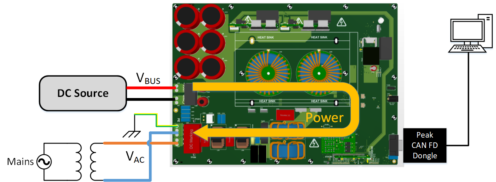

<picture>
    <source media="(prefers-color-scheme: dark)" srcset="images/microchip_logo_white_red.png">
	<source media="(prefers-color-scheme: light)" srcset="images/microchip_logo_black_red.png">
    
</picture> 

# 3.8kW / 7.6kW dsPIC33C Totem Pole Demonstration Application

  

     
     
    3.8kW / 7.6 kW dsPIC33 Totem Pole 
  

[[back to top](#start-doc)]

## Introduction/Summary

The dsPIC33C Totem Pole Power Factor Correction (PFC) platform, based on Microchips dsPIC33C and Silicon Carbide (SiC) devices, supports rapid prototyping and code development. The primary target application is automotive On-board chargers (OBC), but it can be used for any other industrial or telecom application that requires high power PFC.  

The PFC can be controlled by a dual core dsPIC (dsPIC33CH512MP506). This readme gives an overview of the firmware running on this device. Note that there are two MPLABx projects associated with this deployment, one for the primary core and one for the secondary core.

## Highlights

- Supports the following operating modes at both low voltage and high voltage 
  - Single phase PFC with two legs interleaved
  - Single phase voltage inverter
  - Forward operation, current mode
- CAN communication to PC running Power Board Visualizer GUI
- SPI communication to Isolated Voltage Acquisition Board
- I2C communication to PIC16 on main power board (for housekeeping)

For PFC operation, the input voltage can be AC or DC.

## Related Documents/Collaterals
__Firmware documentation__

- TBD ?

__Hardware Documentation__

- dsPIC33C Totem Pole PFC Development Board User's Guide
- Isolated VoltageAcquisition Board User’s Guide
- SiC FET Plug-In Module (SiC FET PIM) User’s Guide

__Target Device Documentation__

- [dsPIC33CH512MP506 Family Data Sheet](https://www.microchip.com/en-us/product/dsPIC33CH512MP506)
- [dsPIC33CH512MP506 Family Silicon Errata and Data Sheet Clarification](https://ww1.microchip.com/downloads/en/DeviceDoc/dsPIC33CH512MP508-Family-Silicon-Errata-and-Data-Sheet-Clarification-DS80000805K.pdf)

__Please always check for the latest data sheets on the respective product websites:__

- [dsPIC33CH512MP508 Family](https://www.microchip.com/dsPIC33CH512MP508)

[[back to top](#start-doc)]
## Software Used

- [MPLAB&reg; X IDE v6.0](https://www.microchip.com/mplabx-ide-windows-installer)
- [MPLAB&reg; XC16 Compiler v1.70](https://www.microchip.com/en-us/tools-resources/archives/mplab-ecosystem)
- [Microchip Code Configurator v5.1.7](https://www.microchip.com/mplab/mplab-code-configurator)
- [MPLAB® PowerSmart™ Development Suite](https://www.microchip.com/en-us/solutions/power-management-and-conversion/intelligent-power/mplab-powersmart-development-suite)
- [Digital Compensator Design Tool](https://www.microchip.com/developmenttools/ProductDetails/DCDT)

## Hardware Used

- dsPIC33C Totem Pole PFC Development Platform
  - Power Board
  - Isolated Voltage Acquisition Board
  - SiC FET PIM
  - Peak System PCAN-FD Dongle
  

[[back to top](#start-doc)]

# Quick Start Guide

In this section, we describe step by step how to run firmware on the power board. We also describe how to interface with the power board visualizer GUI. 

### Programming Hex File

the DP-PIM comes preprogrammed with PFC single phase mode   
The hex files can be found in hexfiles folder.  
use MPLAB IPE to program using the RJ11 to ICSP connector.    
power the dp pim using micro usb cable  

#### Available HEX Files, parameters of each file, associated PBV 

the board can be ran in 

single phase pfc
Grid tied inverter (GTI) mode  

## PFC Operation
### Hardware Setup

  

     
     
    3.8kW / 7.6 kW dsPIC33 Totem Pole 
  

### Connection to PBV
#### Explaining PBV project with screenshots
### Running the PFC, how to modify parameters at runtime, how to make sure everything runnning fine

## GTI Operation
### Hardware Setup

  

     
     
    3.8kW / 7.6 kW dsPIC33 Totem Pole 
  

### Connection to PBV
#### Explaining PBV project with screenshots
### Running the PFC, how to modify parameters at runtime, how to make sure everything runnning fine

## Firmware Project Structure
### Header File Explainations
### how to change project settings/header files and recompile
#### how are the changes made to header file correspond to PBV project 

## Firmware Description and Operation

### Firmware Overview

See below for a top-level overview of the firmware running on each microcontroller on this development platform. More to follow on this...

  

     
     
    Overview of microcontrollers in the system
  

[[back to top](#start-doc)]

### overview of the microcontrollers of the system
### states in the secondary code ??
### further explainations

